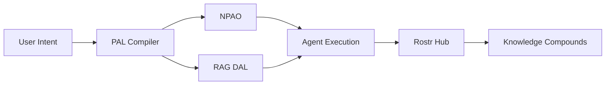

# ROSTR Architecture

**Runtime, Orchestration, State, Tools, Reference** — A unified architecture for production-grade multi-agent systems with phase-aware orchestration and persistent knowledge compounding.

## The Four Pillars



| Pillar | Role | What It Does |
|--------|------|-------------|
| **PAL** | LLM Compiler | Natural language → agent manifest. 5-stage pipeline. |
| **RAG DAL** | Knowledge Engine | 3-tier credibility scoring. Multi-pass retrieval. |
| **NPAO** | Decision Engine | 5D phase taxonomy + 4D priority scoring. Task allocation. |
| **Hub** | Agent OS | 4-level state management. Knowledge compounding. |

## Architecture Flow

```
User Intent
    ↓
PAL Compilation (Intent → Agent Manifest)
    ↓
NPAO Classification (5D Phase + 4D Priority)
    ↓
Agent Execution + RAG DAL (if knowledge needed)
    ↓
Persistent State (Reference Hub)
    ↓
Output + Learning
```

## 5D Phase Taxonomy

| Phase | Purpose | Key Question |
|-------|---------|-------------|
| **PreD** | Determine IF to build | "Is this worth building?" |
| **Design** | Define WHAT to build | "What exactly are we building?" |
| **Development** | Build it | "Does it work?" |
| **Deployment** | Ship it safely | "Is it safe to ship?" |
| **Debugging** | Fix what's broken | "What broke, and why?" |

## 4-Level State Management

| Level | Scope | Storage |
|-------|-------|---------|
| **Session** | Active tasks, in-progress work | In-memory |
| **Project** | Decisions, artifacts, learnings | File-based + vector DB |
| **Organization** | Identity, ICP, positioning | File-based, version-controlled |
| **Agent** | Skills, preferences, calibration | Agent-specific namespace |

## Priority Formula

```
Priority = (Phase_Urgency × 0.35)
         + (Dependency_Impact × 0.30)
         + (Business_Impact × 0.25)
         + (Resource_Efficiency × 0.10)

Thresholds:
  ≥ 7.0  → Immediate allocation
  4.0-6.9 → Queued
  < 4.0 → Backlog
```
