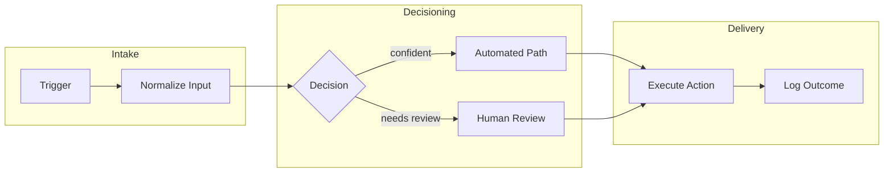
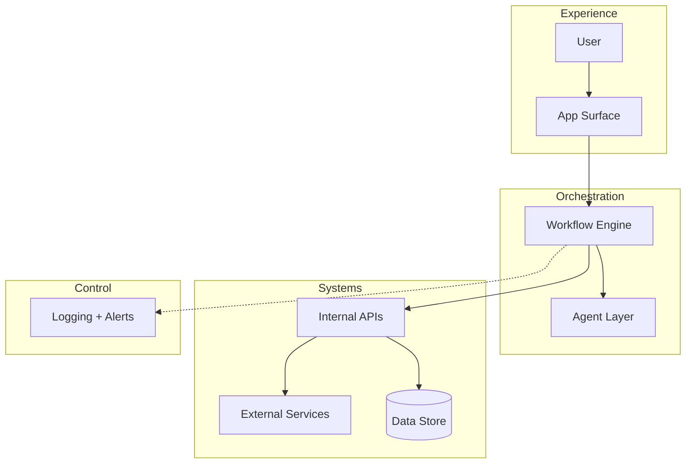
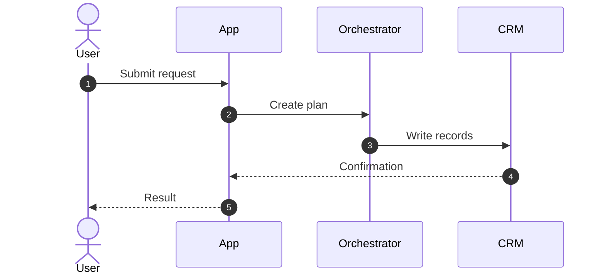
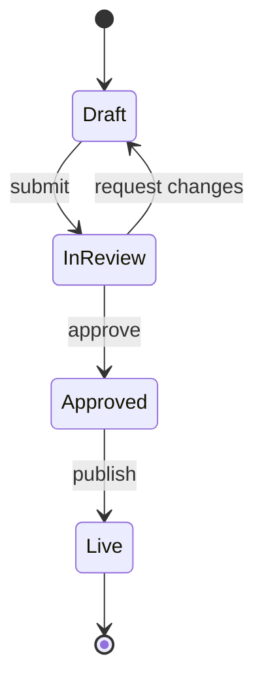
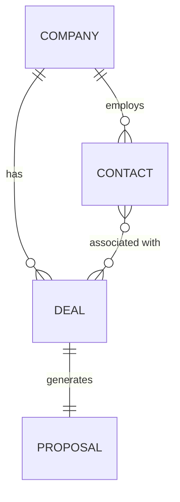
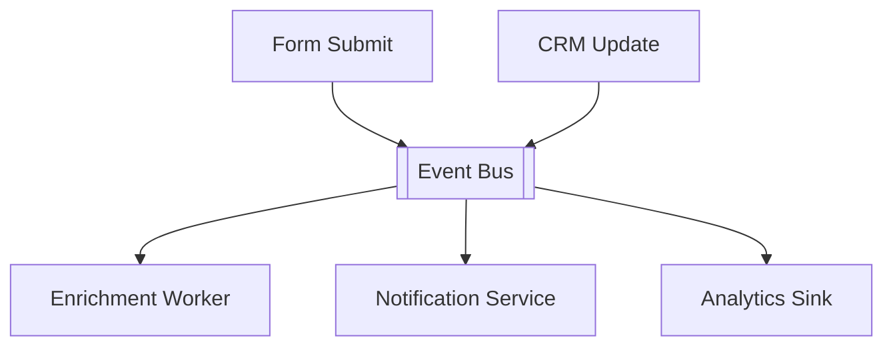
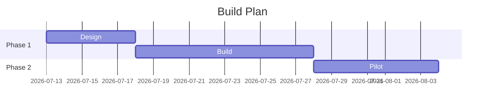

# Diagram Type Selection

Pick the type from the user's underlying question, not their vocabulary. "Architecture diagram" can mean six different things.

## Selection matrix

| User is really asking | Diagram type | SVG layout pattern | Mermaid equivalent |
|---|---|---|---|
| "What are the pieces and how do they connect?" | System architecture | Layered rows + zones | `flowchart TB` + subgraphs |
| "Where does this run / what infra?" | Cloud / deployment | Zones per VPC/region/service tier | `flowchart TB` |
| "Show the system in context" / stakeholder view | C4 Context or Container | Nested zone panels | `flowchart` (C4 syntax is fragile — avoid) |
| "How does data get from A to B?" | Data pipeline / ETL | Left→right lane, stage zones | `flowchart LR` |
| "How do these tools talk to each other?" | Integration / API map | Hub-and-spoke or layered | `flowchart LR` |
| "What happens when a user does X?" (ordered calls) | Sequence | Actor columns + lifelines | `sequenceDiagram` ← often better than SVG |
| "What's the process / who does what?" | Flowchart / swimlane | Lanes per owner, LR | `flowchart LR` + subgraphs |
| "What states can this thing be in?" | State machine / lifecycle | Ring or LR chain of pills | `stateDiagram-v2` |
| "How is the data modeled?" | ERD | Entity cards + relationship lines | `erDiagram` |
| "What's the network layout?" | Network topology | Blueprint theme, subnet zones | `flowchart TB` |
| "What reacts to what event?" | Event-driven / pub-sub | Bus as horizontal spine, producers above, consumers below | `flowchart` |
| "Who reports to whom / team structure?" | Org chart | Tree, top-down | `flowchart TB` |
| "What does the user experience over time?" | User journey | Horizontal stages + emotion/effort row | `journey` |
| "When does what happen?" | Timeline / Gantt | Horizontal bars per workstream | `gantt` ← use Mermaid, not SVG |
| "Help me map the idea space" | Mindmap | Radial-ish, 2 columns per side | `mindmap` |

## Decision rules

- Multiple stories → multiple diagrams. Architecture + sequence is the most common pair.
- Time-ordered interaction between >2 actors → sequence, always.
- >12 nodes → split by zone or by story, or promote detail into the overview doc.
- Gantt/timeline → Mermaid in the HTML viewer (hand-drawing time math in SVG isn't worth it).
- ERD with >8 entities → group into domains, one diagram per domain plus one domain-level map.

## Default layer stack for "architecture"

When the user just says "architecture," default to these rows top→bottom:
1. **Experience** — users, operators, app surfaces
2. **Orchestration** — workflow engine, agents, rules
3. **Systems** — internal APIs, external services, data stores
4. **Control** — observability, secrets, policy (dashed edges into this row)

## Mermaid starters

Workflow flowchart:

Layered architecture:

Sequence:

State machine:

ERD:

Event-driven:

Gantt (always via Mermaid + viewer):

## Layout rules (both SVG and Mermaid)

1. Start from the user-visible event.
2. One idea per node; short noun labels.
3. Group by ownership or trust boundary.
4. Show failure/review paths explicitly.
5. `LR` for processes and pipelines, `TB` for layered architecture and trees.
6. Dashed = async, observability, or policy.
