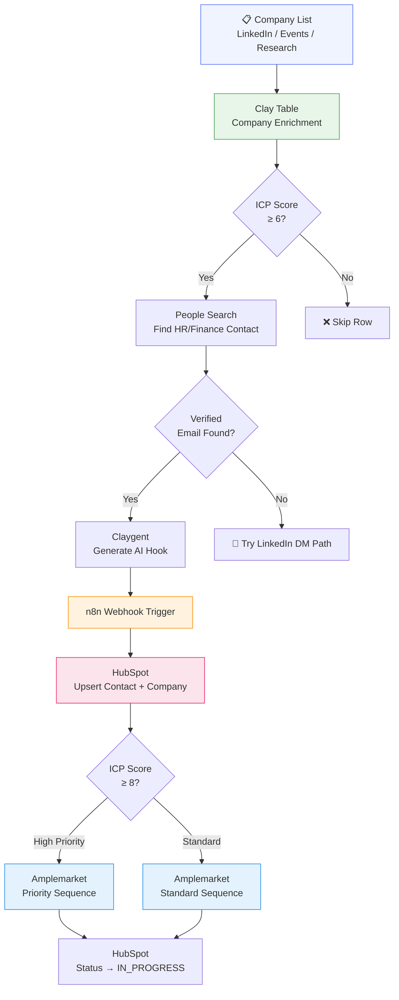
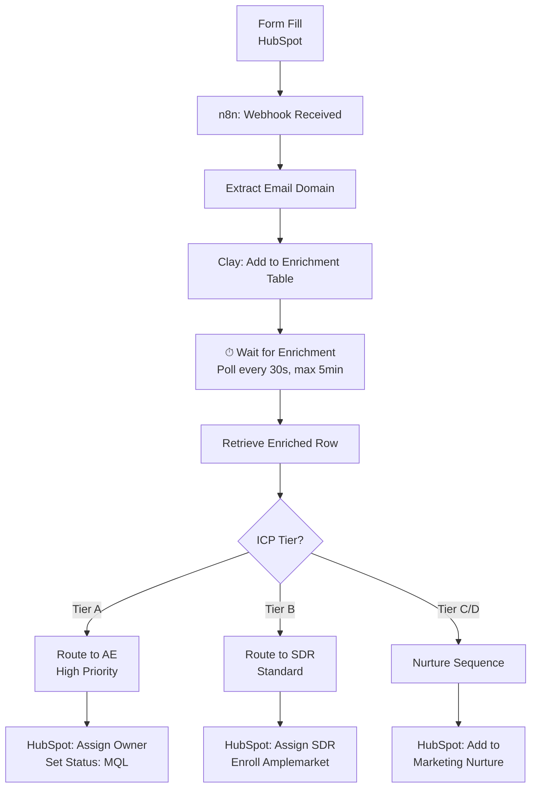
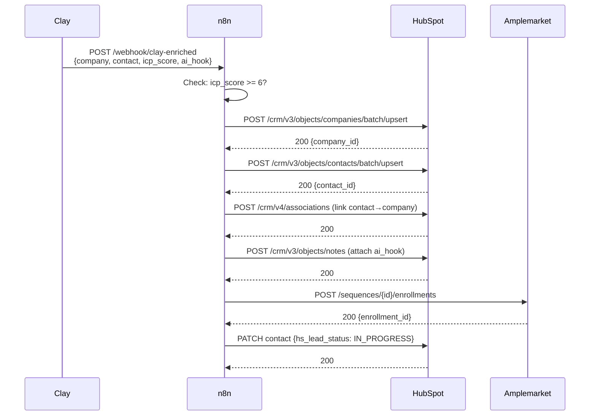
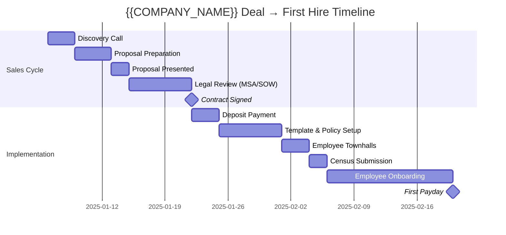
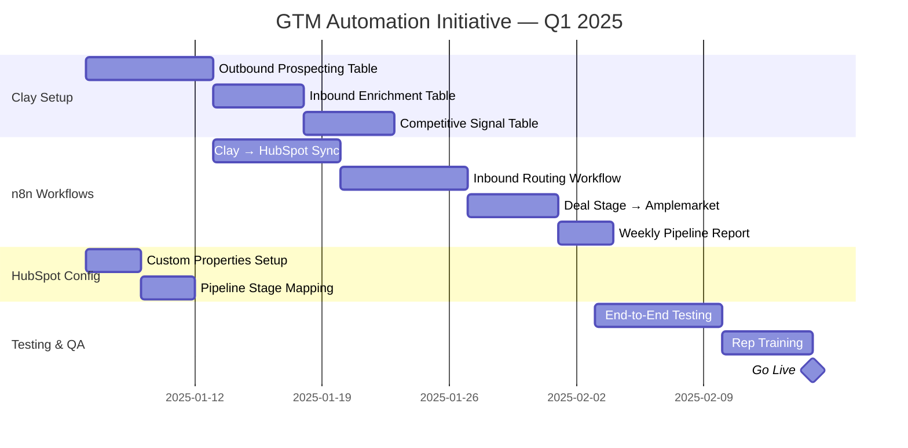
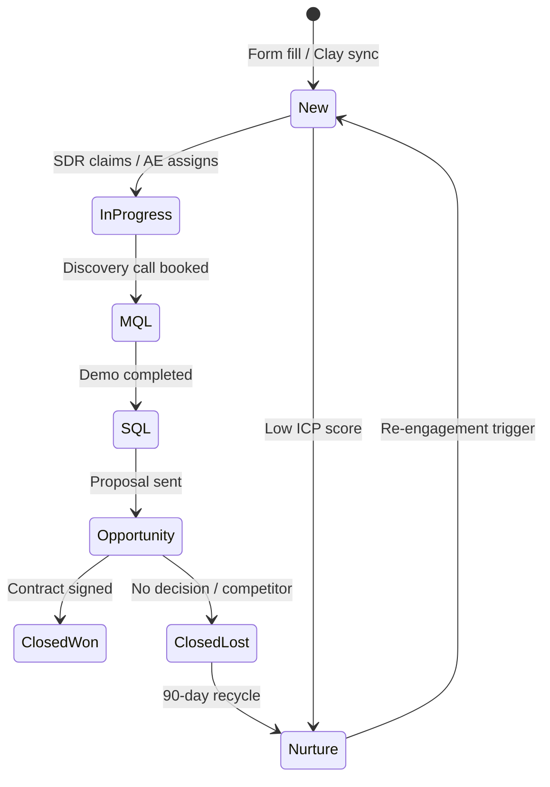
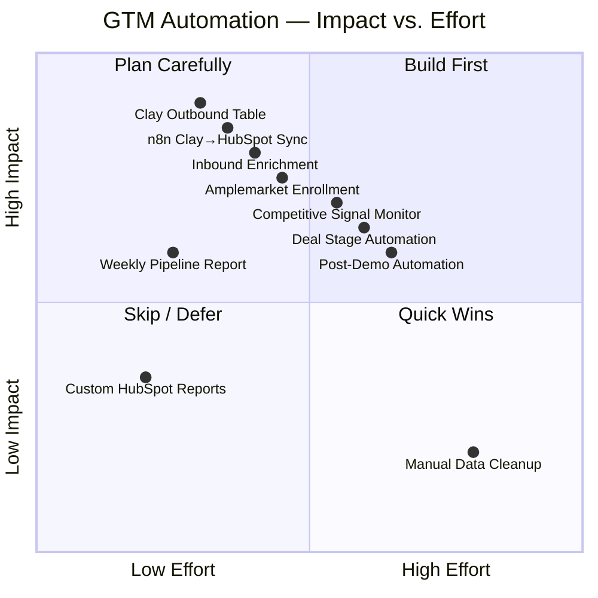
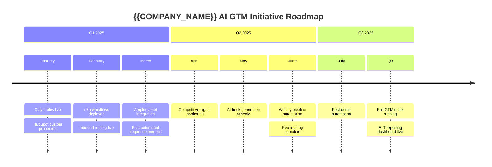
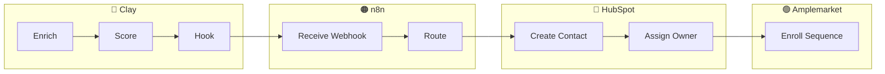

# Mermaid.js — Diagram & Workflow Creation

Mermaid is a free, open-source diagramming library that renders text-based diagram definitions
into visual diagrams. Use it any time you need to communicate:
- System/workflow architecture to engineers or stakeholders
- GTM automation flows for ELT presentations
- Project plans and timelines
- Data flows between tools (Clay → n8n → HubSpot → Amplemarket)
- Process breakdowns for non-technical audiences

Mermaid diagrams render natively in Cowork, GitHub, Notion, Confluence, and many markdown tools.
Output as `.mermaid` files or embed in markdown with ` ```mermaid ` fences.

---

## Diagram Types & When to Use Each

| Type | Best for |
|------|---------|
| `flowchart` | Process flows, decision trees, automation logic |
| `sequenceDiagram` | API interactions, step-by-step flows between systems |
| `gantt` | Project timelines, implementation plans |
| `classDiagram` | Data models, system architecture |
| `stateDiagram` | Status transitions (deal stages, lead lifecycle) |
| `erDiagram` | Database/data structure relationships |
| `journey` | Customer/user journey maps |
| `quadrantChart` | Priority/effort matrices, competitive positioning |
| `mindmap` | Brainstorming, feature breakdown |
| `timeline` | Chronological project or launch plans |
| `xychart` | Bar/line charts for data visualization |

---

## Flowcharts — GTM Automation Flows

Use `flowchart TD` (top-down) for automation pipelines, `LR` for left-to-right data flows.

### Example: Full Outbound Pipeline


### Example: Inbound Lead Routing


---

## Sequence Diagrams — API & System Interactions

Use for showing how tools talk to each other — great for engineers and RevOps.

### Example: Clay → n8n → HubSpot Data Flow


---

## Gantt Charts — Project Plans & Implementation Timelines

### Example: {{COMPANY_NAME}} Sales Cycle + Implementation


### Example: GTM Automation Build Plan


---

## State Diagrams — Lead & Deal Lifecycle

### Example: HubSpot Lead Lifecycle


---

## Quadrant Charts — Prioritization & Strategy

### Example: GTM Automation Priority Matrix


---

## Mind Maps — System Breakdown for Stakeholders

### Example: {{COMPANY_NAME}} GTM Stack Overview
```mermaid
mindmap
  root(({{COMPANY_NAME}} GTM Stack))
    Clay
      Outbound Prospecting
        Company Enrichment
        Contact Finding
        ICP Scoring
        AI Hook Generation
      Inbound Enrichment
        Lead Scoring
        ICP Tier Assignment
      Competitive Monitoring
        Tech Stack Detection
        Displacement Signals
    n8n
      Clay → HubSpot Sync
      Inbound Routing
      Deal Stage Triggers
      Scheduled Reports
      Amplemarket Enrollment
    HubSpot CRM
      Contacts & Companies
      Deal Pipeline
      Sequences
      Custom Properties
      Owner Assignment
    Amplemarket
      Outreach Sequences
      Sequence Variables
      Contact Enrollment
      Performance Analytics
```

---

## Timeline — Product/Initiative Launches



---

## Best Practices for Stakeholder Diagrams

**For ELT / Executive audiences:**
- Use flowcharts with clear swim lanes (use `subgraph` to group by team/system)
- Keep to 1 diagram = 1 concept; don't try to show everything in one chart
- Label decision nodes clearly — executives want to see the logic, not the tech
- Gantt charts land well for timelines and project plans
- Lead with the business outcome, not the tooling

**For engineers / technical audiences:**
- Sequence diagrams for API flows
- Class/ER diagrams for data models
- Use proper technical names (endpoint paths, payload fields)

**For sales / GTM teams:**
- Journey maps and flowcharts
- State diagrams for deal/lead lifecycle
- Quadrant charts for prioritization discussions

**Swim lane pattern (group nodes by owner):**


---

## Saving and Sharing

- Save as `workflow-name.mermaid` in the outputs folder
- Embed in markdown: wrap in ` ```mermaid ``` ` fences
- Render in: Cowork (native), GitHub, Notion, Confluence, VS Code (Mermaid extension), mermaid.live (online editor)
- For presentations: paste into Notion or Confluence, screenshot, drop into slides
- For ELT: export from mermaid.live as SVG for crisp vector rendering in decks
